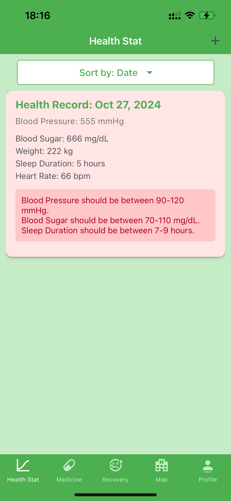
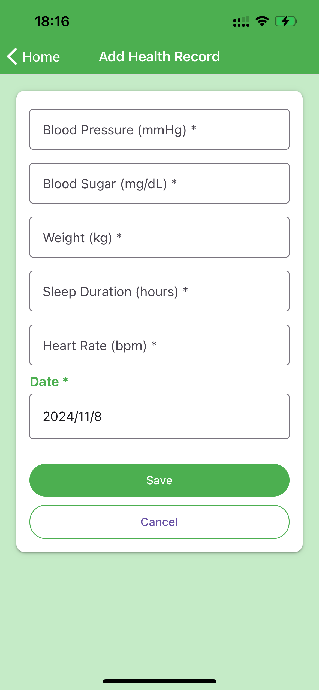
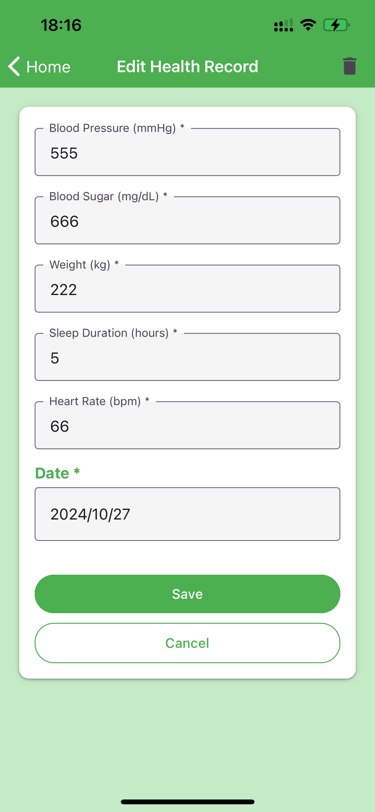
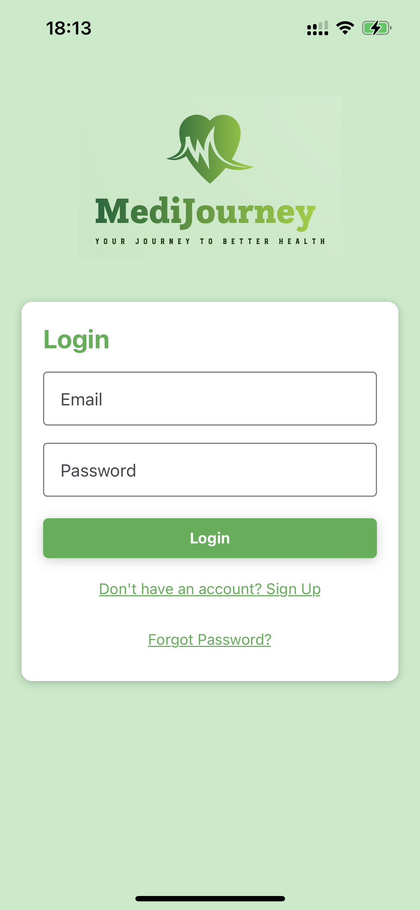
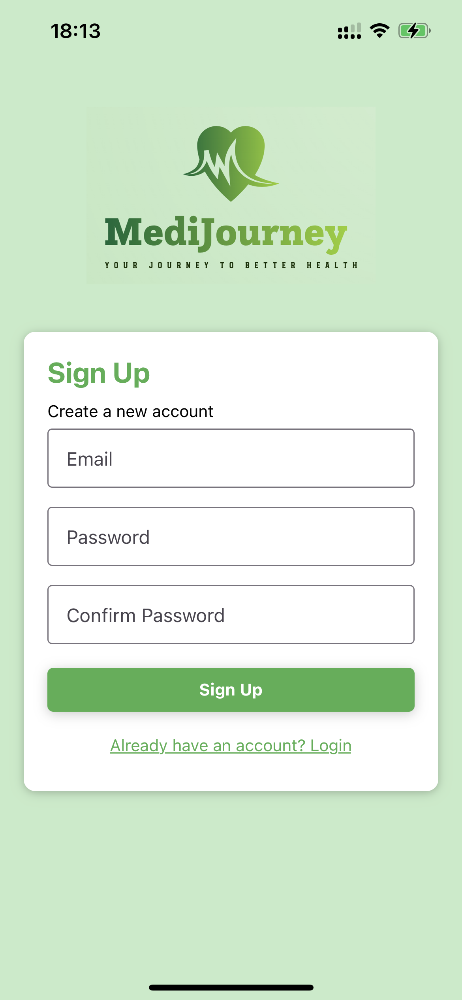
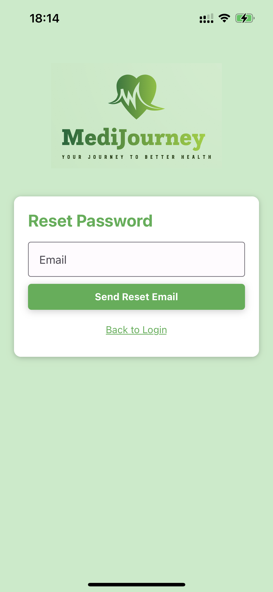

# CS5520-Group-Project

**Group members: Linhao Qian, Tao Wu**

**App name: MediJourney**

## Filestore collections we will use
- healthRecords
- medicine
- recoveryRecords
- users

## Filestore data model
- healthRecords
  - healthRecords1
    - bloodPressure: "90"
    - bloodSugar: "90"
    - date: October 30, 2024 at 2:31:00 AM UTC-7
    - heartRate: "80"
    - sleepDuration: "8"
    - uid: "qwFEuZgt2Md4g1x53fnhWm0Ah1b2"
    - weight: "88"
  - healthRecords2
    - ......
- medicine
  - medicine1
    - condition: "Headache"
    - dosage: "50mg"
    - id: "Y8gd08v9akPObxZpFkzq"
    - medicineName: "Aspirin"
    - notes: "Two times per day"
    - time: "2024-10-30T10:01:19.000Z"
    - uid: "vvgY7KB18kY5WFNs3cpNHgMwTmY2"
  - medicine2
    - ......
- recoveryRecords
  - recoveryRecords1
    - diseaseName: "Covid-19"
    - id: "9gy4AASLJFILWSUH4Je0"
    - notes: "Last week"
    - photos:

      0. "file:///Users/.../xxx.jpg"
      1. "file:///Users/.../xxx.jpg"
    - startDate: "2024-10-30T10:01:19.000Z"
    - symptoms: "Fever"
    - uid: "vvqY7KB18kY5WFNs3cpNHgMwTmY2"
  - recoveryRecords2
    - ......
- users
  - users1
    - age: "23"
    - allergies: "No allergies"
    - avatar: "file:///Users/.../xxx.jpg"
    - email: "1@1.com"
    - gender: "Male”
    - height: "187"
    - uid: "n1tjHX21MQgoiDhM2Z6HI0jJjCh2"
    - username: "Taottt233"
  - users2
    - ......

## The CRUD operations to Firestore
- healthRecords
  - fetchHealthRecords (Read)
  - addOrUpdateHealthRecord (Create & Update)
  - deleteHealthRecord (Delete)
- users
  - createUserProfile (Create)
  - fetchUserProfile (Read)
  - updateUserProfile (Update)
- medicine
  - fetchMedicineReminders (Read)
  - addOrUpdateMedicineReminder (Create & Update)
  - deleteMedicineReminder (Delete)
- recoveryRecords
  - fetchRecoveryRecords (Read All)
  - addOrUpdateRecoveryRecord (Create & Update)
  - deleteRecoveryRecord (Delete)
  - fetchRecoveryRecordById (Read by Id)

## The firebase rules
```
rules_version = '2';
service cloud.firestore {
  match /databases/{database}/documents {
    match /healthRecords/{document=**} {
      allow read: if request.auth != null && request.auth.uid == resource.data.uid;
      allow write: if request.auth != null && 
                   ((resource == null && request.auth.uid == request.resource.data.uid) || 
                   (resource != null && request.auth.uid == resource.data.uid));
    }
    
    match /users/{document=**} {
      allow read: if request.auth != null && request.auth.uid == resource.data.uid;
      allow write: if request.auth != null && 
                   ((resource == null && request.auth.uid == request.resource.data.uid) || 
                   (resource != null && request.auth.uid == resource.data.uid));
    }
  }
}
```
## The current state of the application
So far, we have implemented these following content:
- overall structure
- navigation
- CRUD operations to Firestore
- Login/Signup module
- Health Records module

## What each member has contributed
Tao Wu:
- overall structure
- navigation
- HealthRecordsScreen

&ensp;&ensp;&ensp;&ensp;

- AddHealthRecordScreen

&ensp;&ensp;&ensp;&ensp;

- EditHealthRecordScreen

&ensp;&ensp;&ensp;&ensp;

Linhao Qian:
- CRUD operations to Firestore
- LoginScreen

&ensp;&ensp;&ensp;&ensp;

- SignUpScreen

&ensp;&ensp;&ensp;&ensp;

- ForgotPasswordScreen

&ensp;&ensp;&ensp;&ensp;

- README.md